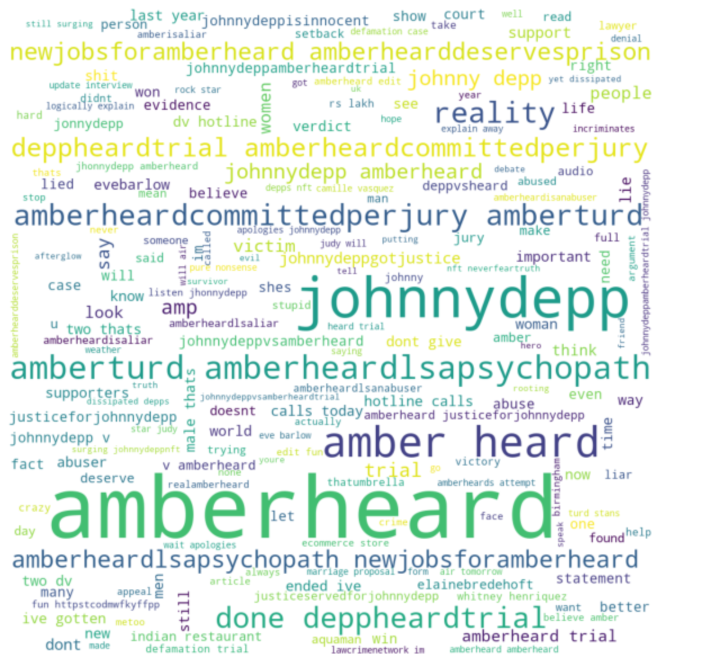

# Sentiment Analysis of the Amber Heard vs Johnny Depp Trial (NLP Project)

## Introduction
It is being said that the internet had already decided that Amber Heard was guilty from the beginning. Out of curiosity, I have decided to process some tweets from twitter and perform some sentiment analysis to see if this was the case. The trial basically started from April 11, 2022, so I searched for tweets from April 1 until basically the end of the trial.

## Project Overview
- Use twitter api to search for a specific hashtag and save data as csv file
- Clean data by removing unnecessary characters including emoji and stop words
- Create Document Term Matrix (DTM)
- Counted the most frequency words
- Created a word cloud
- Use TextBlob to perform sentiment analysis

## Resources
- Python: 3.9.12
- Packages: Pandas, re, string, Seaborn, Matplotlib, sklearn, collections, nltk, wordcloud, textblob

## Results

## Conclusion
From the analysis of the tweets. It is seen that there were mostly negative attitudes towards Amber Heard. This was obvious in the word cloud. Using TextBlob for sentiment analysis did not work as expected, but this was due to use of hashtags which combined the sentiments with Amber Heard and creating a joint word that is not actually an english word.
